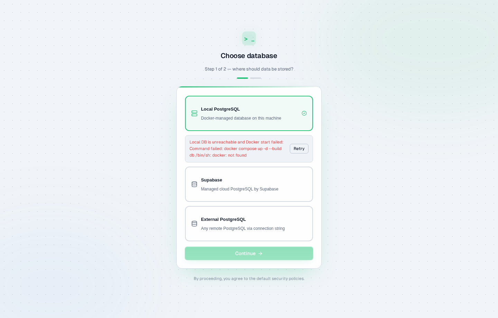
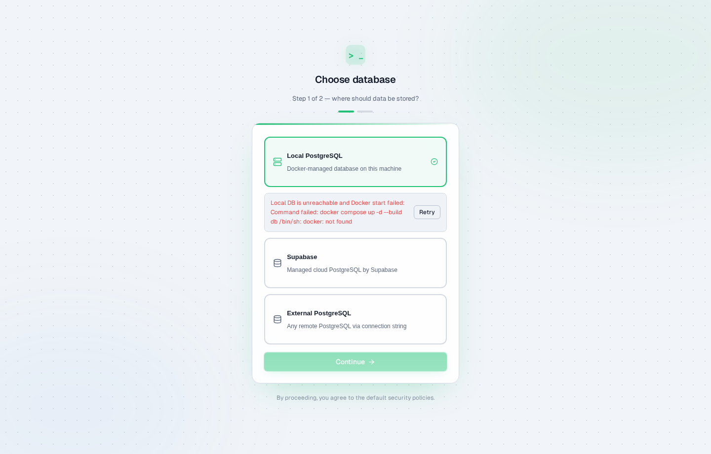
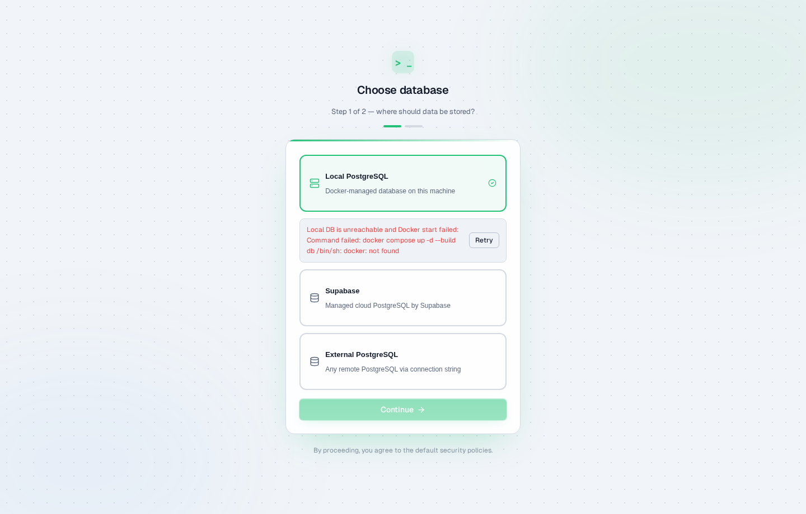
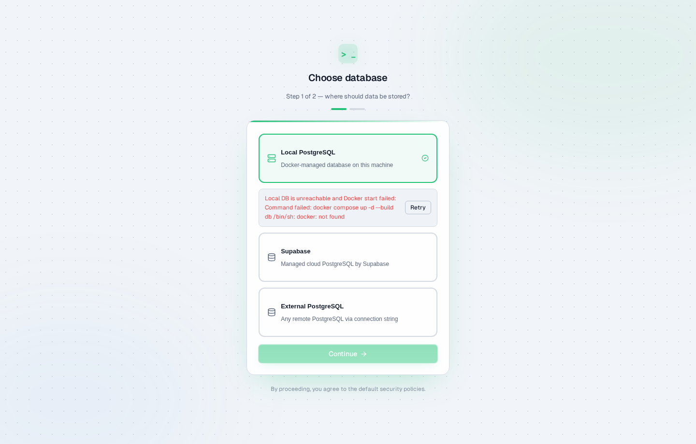
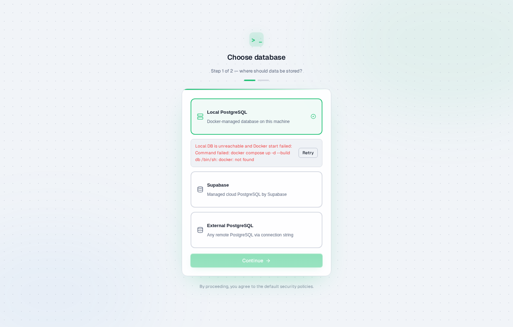

# ServerVault - Open Source Server Inventory Management System

[](LICENSE)
[](https://docs.docker.com/)
[](https://www.typescriptlang.org/)

**ServerVault** is a modern, self-hosted server inventory management application for DevOps teams, sysadmins, and IT professionals. Track all your servers, VMs, and cloud instances in one secure, beautiful dashboard.

> **Keywords:** server inventory, asset management, infrastructure tracking, self-hosted CMDB, IT asset management, server documentation, DevOps tools, data center management

## Why ServerVault?

- **Self-Hosted & Private** - Your data stays on your infrastructure. No cloud dependency, no subscription fees.
- **Modern UI** - Beautiful dark/light theme with Obsidian-inspired terminal aesthetic.
- **Custom Fields** - Add unlimited custom columns to track any server metadata you need.
- **API First** - Full REST API with Bearer token authentication for automation and integrations.
- **Role-Based Access** - Admin and operator roles with granular permissions.
- **2FA Security** - TOTP-based two-factor authentication for enhanced security.

## Features

| Feature | Description |
|---------|-------------|
| **Server Inventory** | Track hostname, public/private IPv4/IPv6, OS, CPU, RAM, and unlimited custom fields |
| **Groups & Tags** | Organize servers with hierarchical groups and color-coded tags |
| **SSH Keys** | Store and manage SSH key metadata for your infrastructure |
| **Custom Columns** | Create any field you need - environment, location, cost center, etc. |
| **Export/Import** | JSON-based backup and restore with full data portability |
| **API Tokens** | Secure bearer tokens for CI/CD, scripts, and n8n workflows |
| **Dashboard** | Visual overview with server counts, status breakdown, and charts |
| **Audit History** | Track all changes with server history log |
| **Dark Mode** | Eye-friendly dark theme that persists across sessions |
| **Cloud Networking (Linode)** | Sync primary + additional public IPs, VPC IPs, NAT 1:1 mappings, and VPC subnet details |
| **Realtime Sync** | WebSocket-driven updates (Socket.IO) with scoped subscriptions, reconnect, and cross-client consistency |

## Cloud Sync Networking (Linode)

When syncing from Linode, ServerVault captures:

- Primary addresses: public/private IPv4 and public/private IPv6 (when present)
- Additional public addresses from public/shared/reserved pools
- VPC private addresses (IPv4/IPv6), NAT 1:1 public mappings, and VPC subnet metadata

In the Servers table, hover an address cell to open the networking popover with available details.
Empty fields are hidden instead of displaying placeholder values.

### Cloud Providers (Coming Soon)

- AWS (official logo shown in Cloud Integrations panel)
- GCP (official logo shown in Cloud Integrations panel)
- DigitalOcean (official logo shown in Cloud Integrations panel)
- Vultr (official logo shown in Cloud Integrations panel)

## Screenshots

> Captured with Playwright script: `scripts/playwright_capture_screenshots.mjs`
> Refresh anytime: `node scripts/playwright_capture_screenshots.mjs http://localhost:8080`

### Login



### Server Inventory



### Server Detail


### Groups



### Tags


### IP Inventory



### Cloud Integrations


### Users


### API Settings


### Profile



### Settings


## Quick Start

### Option 1: Docker (Recommended)

```bash
# Clone the repository
git clone https://github.com/your-username/open-server-inventory.git
cd open-server-inventory

# Start with Docker Compose
docker compose up --build

# Access at http://localhost:8080
```

### Option 2: Manual Installation

**Prerequisites:**
- Node.js 18+
- PostgreSQL 15+

```bash
# Install dependencies
make install

# Configure environment
cp server/.env.example server/.env
# Edit server/.env with your database credentials

# Initialize database
make seed

# Start development server
make dev
```

## Default Login

After initial setup, log in with the default admin account:

| Field | Value |
|-------|-------|
| Username | `admin` |
| Password | `changeme` |

**Important:** You will be prompted to change the password on first login.

## Configuration

Create `server/.env` with these variables:

```env
# Database
POSTGRES_HOST=localhost
POSTGRES_PORT=5432
POSTGRES_USER=postgres
POSTGRES_PASSWORD=your-secure-password
POSTGRES_DATABASE=servervault

# Security (required in production)
SESSION_SECRET=your-32-character-minimum-random-secret

# Optional
CLIENT_URL=http://localhost:8080
NODE_ENV=production
REDIS_URL=redis://localhost:6379
```

`REDIS_URL` is optional, but recommended for multi-instance/horizontal deployments to fan out socket events across all app nodes.

## API Usage

ServerVault provides a full REST API for automation:

```bash
# Create an API token in Profile > API Tokens
# Use it for programmatic access:

# List all servers
curl -H "Authorization: Bearer sv_your_token" \
     http://localhost:8080/api/servers

# Add a new server
curl -X POST \
     -H "Authorization: Bearer sv_your_token" \
     -H "Content-Type: application/json" \
     -d '{"name": "web-01", "hostname": "web-01.example.com", "ip_address": "10.0.0.1"}' \
     http://localhost:8080/api/servers
```

### n8n Integration

1. Create a **Header Auth** credential with:
   - Name: `Authorization`
   - Value: `Bearer sv_your_token`
2. Use **HTTP Request** nodes to interact with `/api/servers`, `/api/groups`, etc.

## Architecture

```
open-server-inventory/
├── client/          # React + TypeScript + Vite frontend
│   ├── src/
│   │   ├── pages/       # Dashboard, Servers, Groups, Tags, Users
│   │   ├── components/  # Reusable UI components
│   │   └── store/       # Zustand state management
│   └── ...
├── server/          # Express.js + TypeScript backend
│   ├── src/
│   │   ├── routes/      # REST API endpoints
│   │   ├── middleware/  # Auth, validation
│   │   └── db/          # PostgreSQL schema & queries
│   └── ...
└── docker-compose.yml
```

## Tech Stack

| Layer | Technology |
|-------|------------|
| Frontend | React 18, TypeScript, Vite, Tailwind CSS, Zustand, Framer Motion |
| Backend | Express.js, TypeScript, PostgreSQL, express-session, Zod |
| Fonts | Geist Sans, Geist Mono |
| Icons | Lucide React |
| Auth | Session cookies + Bearer tokens, TOTP 2FA |

## Deployment

### Docker Production

```yaml
# docker-compose.prod.yml
services:
  server:
    image: servervault:latest
    ports:
      - "8080:8080"
    environment:
      - NODE_ENV=production
      - SESSION_SECRET=${SESSION_SECRET}
      - DATABASE_URL=postgresql://user:pass@db:5432/servervault
```

### Behind Nginx

```nginx
server {
    listen 443 ssl;
    server_name inventory.example.com;

    location / {
        proxy_pass http://127.0.0.1:8080;
        proxy_set_header Host $host;
        proxy_set_header X-Real-IP $remote_addr;
    }
}
```

## Contributing

Contributions are welcome! Please read our contributing guidelines before submitting PRs.

1. Fork the repository
2. Create a feature branch (`git checkout -b feature/amazing-feature`)
3. Commit your changes (`git commit -m 'Add amazing feature'`)
4. Push to the branch (`git push origin feature/amazing-feature`)
5. Open a Pull Request

## Roadmap

- [ ] LDAP/SSO integration
- [ ] Server health monitoring via agents
- [ ] Ansible inventory export
- [ ] Terraform state import
- [ ] Multi-tenancy support

## License

This project is licensed under the MIT License - see the [LICENSE](LICENSE) file for details.

---

<p align="center">
  <strong>ServerVault</strong> - Your servers, your data, your control.
  <br/>
  <a href="#quick-start">Get Started</a> | <a href="#features">Features</a> | <a href="#api-usage">API Docs</a>
</p>
